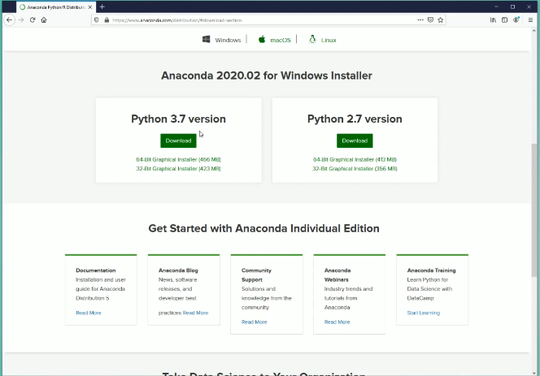

# Installing Python
There are many ways to get python installed onto your computer. The one that we are going to use is call [Anaconda](https://www.anaconda.com/). The benefit is that this will install everything we need and give us a way to create *virtual environments*. It will also give us a great platform for when we want to work with data and look at some basic *AI*.

Use the link above and download the setup file

In most cases just click on the **Download** button under the **Python 3.x version**. In the image above the version of Python available is 3.7, this might be different but you want to get Python 3.

Once you have downloaded the setup file, its time to get it to install. Got to you downloads folder. You can noramlly find it in the file explorer. Find the file and double click on it.
